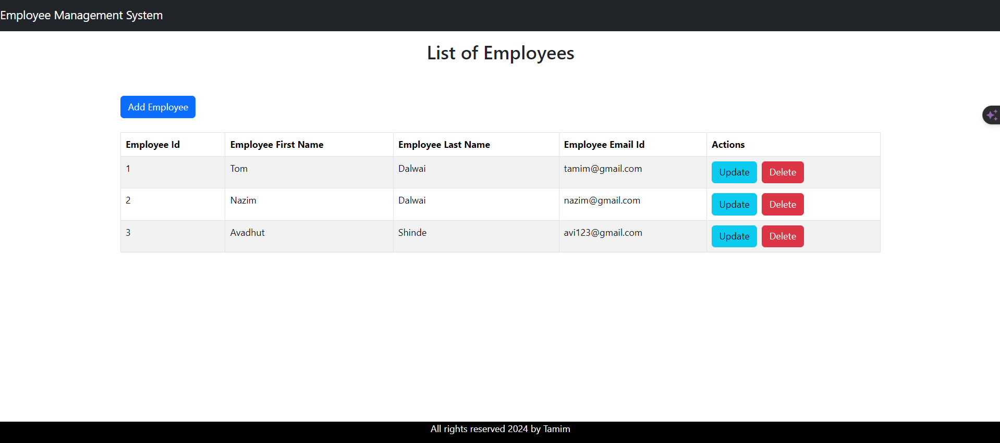
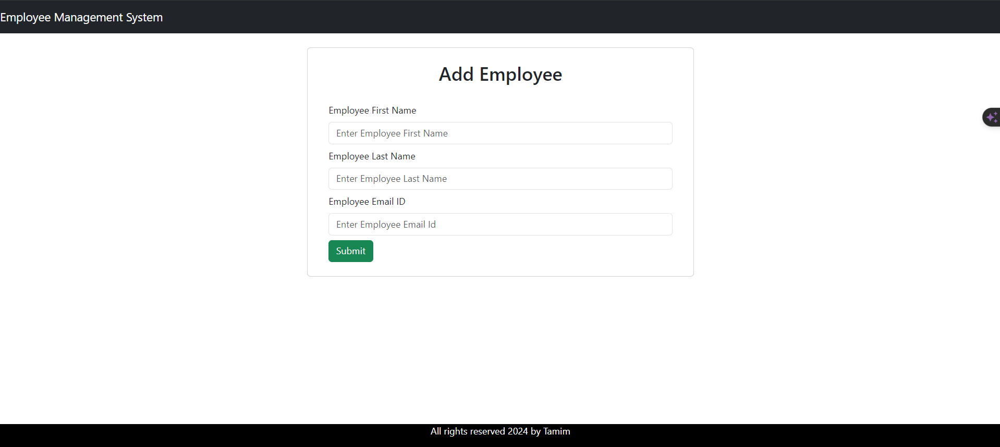

<h1 align="center">Employee Management System</h1>

<p align="center">
  
</p>

<p align="center">This is a simple Employee Management System project developed using ReactJS for the frontend and Spring Boot for the backend. The project allows users to perform CRUD (Create, Read, Update, Delete) operations on employee records.</p>

## Features

- **Create:** Add new employees to the system with their details such as name, position, and salary.
- **Read:** View a list of all employees with their details.
- **Update:** Modify existing employee records, such as updating their position or salary.
- **Delete:** Remove employees from the system.

## Technologies Used

<details>
<summary><b>Frontend</b></summary>

- ReactJS
- HTML
- CSS
- Axios (for handling HTTP requests)
</details>

<details>
<summary><b>Backend</b></summary>

- Spring Boot
- Java
- Spring Data JPA (for interacting with the database)
- MySQL (or any other relational database of your choice)
</details>

## Setup Instructions

1. **Clone the repository:**

   ```bash
   git clone https://github.com/tamimdalwai/Employee-Management-ReactJs-Spring-boot-.git
   ```

2. **Navigate to the frontend directory:**

   ```bash
   cd employee-management-system-frontend
   ```

3. **Install dependencies:**

   ```bash
   npm install
   ```

4. **Start the frontend server:**

   ```bash
   npm start
   ```

5. **Navigate to the backend directory:**

   ```bash
   cd ../EmployeeManagementBackend
   ```

6. **Import the project into your preferred IDE (Eclipse, IntelliJ, etc.)**

7. **Run the Spring Boot application:**

   - Run the main method in `EmployeeManagementBackendApplication.java`

8. **Access the application:**
   - Open your web browser and go to `http://localhost:3000` to access the frontend.

## Database Configuration

- The project uses MySQL as the default database.
- Modify the `application.properties` file in the backend to configure your MySQL database connection.

## Screenshots





## License

This project is licensed under the [MIT License](LICENSE).

</details>
